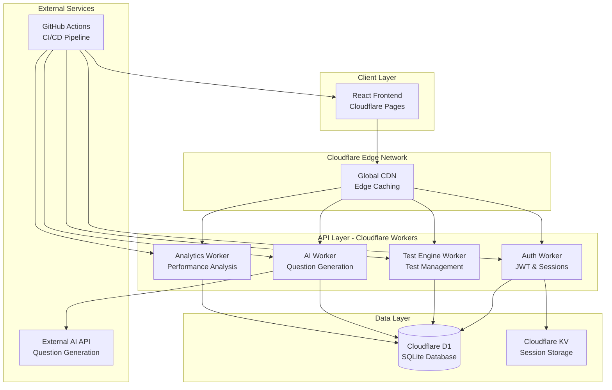

# Design Document: EAMCET Mock Test Platform

## Overview

The EAMCET Mock Test Platform is a serverless, full-stack application built entirely on Cloudflare's edge computing infrastructure. The platform provides AI-powered mock tests, real-time analytics, and comprehensive progress tracking for EAMCET exam preparation. The architecture leverages Cloudflare Pages for the frontend, Cloudflare Workers for the backend API, and Cloudflare D1 for data persistence, ensuring global performance and cost efficiency.

The system is designed with a microservices approach where each Cloudflare Worker handles specific domain responsibilities (authentication, test management, analytics, AI question generation). This design ensures scalability, maintainability, and optimal resource utilization within Cloudflare's free tier limits.

## Architecture

### High-Level Architecture



### Deployment Architecture

The platform follows a serverless-first approach with automatic scaling and global distribution:

- **Frontend**: Static React application deployed to Cloudflare Pages with automatic GitHub integration
- **Backend**: Multiple Cloudflare Workers handling different API domains with shared data access
- **Database**: Cloudflare D1 providing SQLite-compatible relational database with edge replication
- **Caching**: Cloudflare KV for session management and frequently accessed data
- **CI/CD**: GitHub Actions workflows for automated testing and deployment

## Components and Interfaces

### Frontend Components (React + TypeScript)

#### Authentication Module

- **LoginForm**: Handles user authentication with email/password
- **RegisterForm**: User registration with email verification
- **ProfileManager**: User profile editing and preferences
- **AuthGuard**: Route protection for authenticated users

#### Test Taking Interface

- **TestLauncher**: Test selection and configuration interface
- **QuestionRenderer**: Displays questions with EAMCET-style formatting
- **NavigationPanel**: Question navigation, marking, and progress tracking
- **TimerComponent**: Real-time countdown with visual indicators
- **SubmissionHandler**: Test submission and confirmation dialogs

#### Analytics Dashboard

- **PerformanceDashboard**: Main analytics overview with charts and metrics
- **SubjectAnalysis**: Subject-wise performance breakdown
- **ProgressTracker**: Historical progress visualization
- **ComparisonView**: Test-to-test performance comparison
- **RecommendationEngine**: AI-powered study suggestions

#### Data Visualization

- **ChartComponents**: Reusable chart components (line, bar, radar charts)
- **MetricsCards**: Key performance indicator displays
- **TrendAnalysis**: Progress trend visualization
- **HeatmapView**: Time management and difficulty analysis

### Backend Workers (Cloudflare Workers)

#### Authentication Worker (`/auth/*`)

```typescript
interface AuthWorker {
  // User registration and login
  POST /auth/register: (userData: UserRegistration) => AuthResponse
  POST /auth/login: (credentials: LoginCredentials) => AuthResponse
  POST /auth/logout: () => LogoutResponse

  // Session management
  GET /auth/verify: () => SessionValidation
  POST /auth/refresh: (refreshToken: string) => TokenRefresh

  // Profile management
  GET /auth/profile: () => UserProfile
  PUT /auth/profile: (profileData: UserProfile) => UpdateResponse
}
```

#### Test Engine Worker (`/tests/*`)

```typescript
interface TestEngineWorker {
  // Test management
  GET /tests/available: () => AvailableTest[]
  POST /tests/start: (testConfig: TestConfiguration) => TestSession
  GET /tests/session/:id: () => TestSessionState

  // Question handling
  GET /tests/session/:id/question/:num: () => QuestionData
  POST /tests/session/:id/answer: (answer: AnswerSubmission) => SubmissionResponse

  // Test completion
  POST /tests/session/:id/submit: () => TestResults
  GET /tests/history: () => TestHistory[]
}
```

#### AI Question Generator Worker (`/ai/*`)

```typescript
interface AIWorker {
  // Question generation
  POST /ai/generate-questions: (params: GenerationParams) => Question[]
  POST /ai/validate-question: (question: Question) => ValidationResult

  // Content analysis
  POST /ai/analyze-performance: (testData: TestResults) => PerformanceInsights
  POST /ai/generate-recommendations: (userHistory: TestHistory[]) => Recommendation[]
}
```

#### Analytics Worker (`/analytics/*`)

```typescript
interface AnalyticsWorker {
  // Performance analysis
  GET /analytics/performance/:userId: () => PerformanceMetrics
  GET /analytics/subject-analysis/:userId: () => SubjectBreakdown
  GET /analytics/progress/:userId: () => ProgressData

  // Comparative analysis
  GET /analytics/compare/:userId: (testIds: string[]) => ComparisonData
  GET /analytics/trends/:userId: () => TrendAnalysis
}
```

## Data Models

### Database Schema (Cloudflare D1)

```sql
-- Users table
CREATE TABLE users (
    id TEXT PRIMARY KEY,
    email TEXT UNIQUE NOT NULL,
    password_hash TEXT NOT NULL,
    name TEXT NOT NULL,
    created_at DATETIME DEFAULT CURRENT_TIMESTAMP,
    updated_at DATETIME DEFAULT CURRENT_TIMESTAMP,
    email_verified BOOLEAN DEFAULT FALSE,
    profile_data JSON
);

-- Test sessions table
CREATE TABLE test_sessions (
    id TEXT PRIMARY KEY,
    user_id TEXT NOT NULL,
    test_type TEXT NOT NULL,
    status TEXT NOT NULL, -- 'active', 'completed', 'abandoned'
    started_at DATETIME NOT NULL,
    completed_at DATETIME,
    duration_seconds INTEGER,
    total_questions INTEGER NOT NULL,
    configuration JSON NOT NULL,
    FOREIGN KEY (user_id) REFERENCES users(id)
);

-- Questions table
CREATE TABLE questions (
    id TEXT PRIMARY KEY,
    subject TEXT NOT NULL, -- 'physics', 'chemistry', 'mathematics'
    difficulty TEXT NOT NULL, -- 'easy', 'medium', 'hard'
    question_text TEXT NOT NULL,
    options JSON NOT NULL, -- Array of answer options
    correct_answer TEXT NOT NULL,
    explanation TEXT,
    source_pattern TEXT, -- Reference to past paper pattern
    created_at DATETIME DEFAULT CURRENT_TIMESTAMP,
    metadata JSON
);

-- Test questions (junction table)
CREATE TABLE test_questions (
    id TEXT PRIMARY KEY,
    test_session_id TEXT NOT NULL,
    question_id TEXT NOT NULL,
    question_number INTEGER NOT NULL,
    FOREIGN KEY (test_session_id) REFERENCES test_sessions(id),
    FOREIGN KEY (question_id) REFERENCES questions(id),
    UNIQUE(test_session_id, question_number)
);

-- User answers table
CREATE TABLE user_answers (
    id TEXT PRIMARY KEY,
    test_session_id TEXT NOT NULL,
    question_id TEXT NOT NULL,
    selected_answer TEXT,
    is_correct BOOLEAN,
    time_spent_seconds INTEGER,
    answered_at DATETIME,
    is_marked_for_review BOOLEAN DEFAULT FALSE,
    FOREIGN KEY (test_session_id) REFERENCES test_sessions(id),
    FOREIGN KEY (question_id) REFERENCES questions(id),
    UNIQUE(test_session_id, question_id)
);

-- Performance analytics table
CREATE TABLE performance_analytics (
    id TEXT PRIMARY KEY,
    user_id TEXT NOT NULL,
    test_session_id TEXT NOT NULL,
    subject TEXT NOT NULL,
    total_questions INTEGER NOT NULL,
    correct_answers INTEGER NOT NULL,
    accuracy_percentage REAL NOT NULL,
    average_time_per_question REAL NOT NULL,
    strengths JSON, -- Array of strength areas
    weaknesses JSON, -- Array of weakness areas
    calculated_at DATETIME DEFAULT CURRENT_TIMESTAMP,
    FOREIGN KEY (user_id) REFERENCES users(id),
    FOREIGN KEY (test_session_id) REFERENCES test_sessions(id)
);

-- Progress tracking table
CREATE TABLE progress_tracking (
    id TEXT PRIMARY KEY,
    user_id TEXT NOT NULL,
    metric_name TEXT NOT NULL, -- 'overall_score', 'physics_score', etc.
    metric_value REAL NOT NULL,
    recorded_at DATETIME DEFAULT CURRENT_TIMESTAMP,
    test_session_id TEXT,
    FOREIGN KEY (user_id) REFERENCES users(id),
    FOREIGN KEY (test_session_id) REFERENCES test_sessions(id)
);
```

### TypeScript Interfaces

```typescript
// Core data models
interface User {
  id: string;
  email: string;
  name: string;
  createdAt: Date;
  updatedAt: Date;
  emailVerified: boolean;
  profileData: UserProfileData;
}

interface UserProfileData {
  targetScore?: number;
  preferredSubjects?: string[];
  studyGoals?: string[];
  timeZone?: string;
}

interface TestSession {
  id: string;
  userId: string;
  testType: 'full' | 'subject-wise' | 'custom';
  status: 'active' | 'completed' | 'abandoned';
  startedAt: Date;
  completedAt?: Date;
  durationSeconds?: number;
  totalQuestions: number;
  configuration: TestConfiguration;
}

interface TestConfiguration {
  subjects: string[];
  questionsPerSubject: number;
  timeLimit: number; // in minutes
  difficulty: 'mixed' | 'easy' | 'medium' | 'hard';
  randomizeQuestions: boolean;
}

interface Question {
  id: string;
  subject: 'physics' | 'chemistry' | 'mathematics';
  difficulty: 'easy' | 'medium' | 'hard';
  questionText: string;
  options: string[];
  correctAnswer: string;
  explanation?: string;
  sourcePattern: string;
  metadata: QuestionMetadata;
}

interface QuestionMetadata {
  topic: string;
  subtopic?: string;
  yearSource?: number;
  estimatedTime: number; // seconds
  conceptTags: string[];
}

interface UserAnswer {
  id: string;
  testSessionId: string;
  questionId: string;
  selectedAnswer?: string;
  isCorrect: boolean;
  timeSpentSeconds: number;
  answeredAt?: Date;
  isMarkedForReview: boolean;
}

interface PerformanceAnalytics {
  id: string;
  userId: string;
  testSessionId: string;
  subject: string;
  totalQuestions: number;
  correctAnswers: number;
  accuracyPercentage: number;
  averageTimePerQuestion: number;
  strengths: string[];
  weaknesses: string[];
  calculatedAt: Date;
}
```

## Error Handling

### Frontend Error Handling

- **Network Errors**: Automatic retry with exponential backoff for API calls
- **Authentication Errors**: Automatic token refresh and redirect to login when needed
- **Validation Errors**: Real-time form validation with user-friendly error messages
- **Test Session Errors**: Auto-save functionality to prevent data loss during connectivity issues

### Backend Error Handling

- **Database Errors**: Proper error logging and graceful degradation
- **AI Service Errors**: Fallback to cached questions when AI generation fails
- **Rate Limiting**: Implement rate limiting to prevent abuse and ensure fair usage
- **Data Validation**: Comprehensive input validation and sanitization

### Error Response Format

```typescript
interface ErrorResponse {
  error: {
    code: string;
    message: string;
    details?: any;
    timestamp: string;
    requestId: string;
  };
}
```

## Testing Strategy

_A property is a characteristic or behavior that should hold true across all valid executions of a system—essentially, a formal statement about what the system should do. Properties serve as the bridge between human-readable specifications and machine-verifiable correctness guarantees._

### Dual Testing Approach

The testing strategy employs both unit tests and property-based tests to ensure comprehensive coverage:

- **Unit Tests**: Focus on specific examples, edge cases, and integration points between components
- **Property Tests**: Verify universal properties across all possible inputs using randomized testing
- **Integration Tests**: Validate end-to-end workflows and component interactions
- **Performance Tests**: Ensure system meets response time and scalability requirements

### Property-Based Testing Configuration

All property tests will use **fast-check** library for TypeScript/JavaScript with minimum 100 iterations per test. Each property test must reference its corresponding design document property using the tag format: **Feature: eamcet-mock-test-platform, Property {number}: {property_text}**

### Unit Testing Balance

Unit tests complement property tests by focusing on:

- Specific examples that demonstrate correct behavior
- Edge cases and error conditions that need explicit verification
- Integration points between Cloudflare Workers and external services
- Authentication flows and security validations

Property tests handle comprehensive input coverage through randomization, reducing the need for extensive unit test suites while ensuring universal correctness properties are validated.

## Correctness Properties

Based on the prework analysis and property reflection, the following properties ensure the system behaves correctly across all valid inputs:

### Property 1: Authentication System Integrity

_For any_ valid user registration data, the authentication system should create a secure account, allow login with correct credentials, and prevent access to protected resources without authentication.
**Validates: Requirements 1.1, 1.2, 1.3**

### Property 2: Data Persistence Round Trip

_For any_ user data (profiles, test results, answers), storing then retrieving the data should produce equivalent information without loss or corruption.
**Validates: Requirements 1.4, 1.5, 2.5, 3.3, 6.1**

### Property 3: Question Generation Compliance

_For any_ test configuration, generated questions should cover all required subjects, maintain proper difficulty distribution, follow EAMCET format, and include complete metadata.
**Validates: Requirements 2.1, 2.2, 2.3, 2.4**

### Property 4: Test Session State Management

_For any_ test session, the system should properly initialize timing, maintain navigation state, handle answer submissions, and enforce time limits consistently.
**Validates: Requirements 3.1, 3.2, 3.4, 3.5, 8.1, 8.4**

### Property 5: Analytics Calculation Accuracy

_For any_ completed test data, the analytics engine should calculate performance metrics within time limits, identify strengths/weaknesses, analyze time patterns, and generate actionable insights.
**Validates: Requirements 4.1, 4.2, 4.3, 4.4, 4.5**

### Property 6: Progress Tracking Consistency

_For any_ user's test history, the system should maintain complete records, display accurate trends, provide meaningful comparisons, identify patterns, and generate progress reports.
**Validates: Requirements 5.1, 5.2, 5.3, 5.4, 5.5**

### Property 7: Historical Data Integrity

_For any_ user's test attempts, the system should store complete data, allow retrieval of all sessions, provide detailed analysis, maintain data integrity, and support filtering operations.
**Validates: Requirements 6.2, 6.3, 6.4, 6.5**

### Property 8: Real-Time Performance Monitoring

_For any_ active test session, the system should provide appropriate performance hints, time management reminders, and progress indicators without compromising test integrity.
**Validates: Requirements 8.2, 8.3**

### Property 9: Security and Access Control

_For any_ user data and system access, the system should enforce encryption, implement proper access controls, maintain secure sessions, and prevent unauthorized access.
**Validates: Requirements 9.1, 9.2, 9.3**

### Property 10: Performance and Caching

_For any_ system operation, the interface should load within performance limits, maintain data integrity under concurrent access, and utilize caching effectively to minimize response times.
**Validates: Requirements 10.1, 10.3, 10.4**
